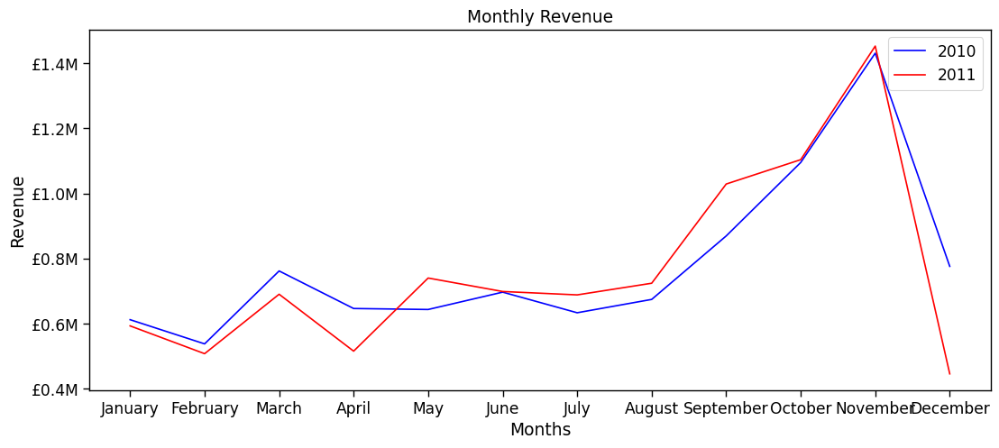
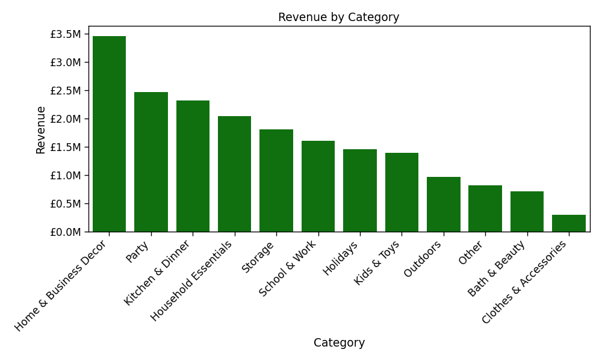
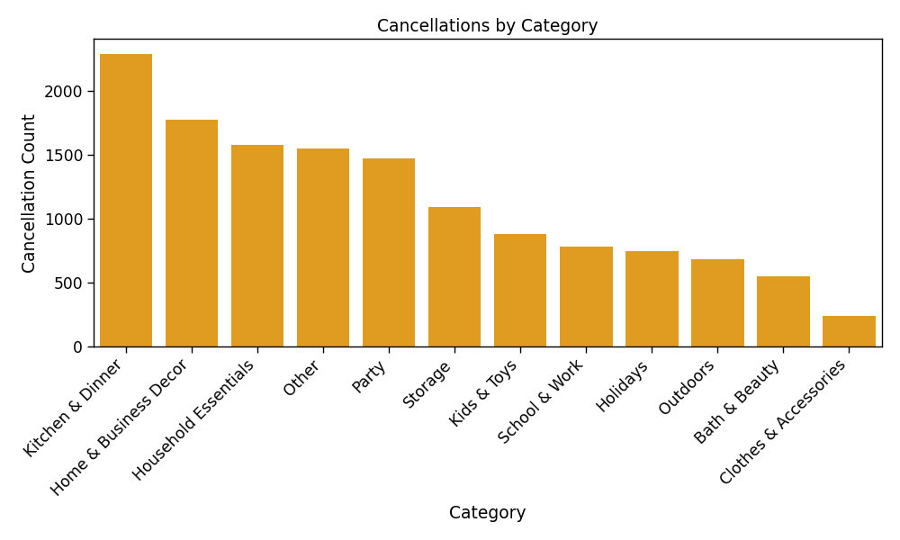

# E-Commerce Sales Analysis

## Overview
This project analyzes over one million online retail transactions from a UK-based gift retailer between 2010 and 2011. The project uses Python and data analysis libraries to clean and explore the dataset to identify sales trends, product performance, monthly and geographic patterns, and cancellation trends. The analysis concludes with business insights and actionable recommendations supported by data visualizations.

**Kaggle Notebook**: [E-Commerce Sales Analysis on Kaggle](https://www.kaggle.com/code/takia2006/e-commerce-sales-analysis)

## Data Source
Chen, D. (2012). Online Retail II [Dataset]. UCI Machine Learning Repository. https://doi.org/10.24432/C5CG6D.

**Dataset Link**: [Online Retail II](https://archive.ics.uci.edu/dataset/502/online+retail+ii)

* **Source:** UCI Machine Learning Repository (Online Retail II Dataset)
* **Time Period:** December 2009 – December 2011
* **Transactions:** Over 1 million
* **Countries:** 43
* **Customers:** Approximately 6,000
* **Products:** Approximately 5,000

## Objectives

* Clean and prepare raw transactional data for analysis.
* Identify top-performing product categories.
* Analyze seasonal and monthly sales trends.
* Examine geographic sales distribution.
* Investigate cancellation patterns.
* Generate business insights and recommendations.

## Tools & Libraries

* Python
* Pandas
* NumPy
* Matplotlib
* Seaborn
* Plotly
* Jupyter Notebook
* Excel

## Data Cleaning

The dataset required extensive preprocessing before analysis, including:

* Handling missing values
* Removing cancelled transactions from the primary sales analysis
* Investigating and correcting obvious pricing anomalies
* Creating a `TotalPrice` column
* Extracting Month and Year from transaction dates
* Creating custom product categories using keyword matching
* Removing duplicate records where appropriate
* Converting columns to appropriate data types

## Analysis

The notebook explores several aspects of the business, including:

* Exploratory data analysis
* Product category performance
* Revenue and sales trends
* Customer purchasing behavior
* Geographic sales distribution
* Cancellation analysis
* Monthly trends and seasonal demand patterns

## Visualizations Sample 

### Monthly Revenue

Sales peaked during the holiday season, with November generating the highest revenue.

### Revenue by Product Category

Home & Business Decor generated the highest overall revenue.

### Cancellations by Category

Kitchen & Dinner had the most cancellations.

View `visualizations` folder to see all the visualizations.

## Key Findings

- Home & Business Decor generated the highest overall revenue, making it the retailer's strongest-performing product category.
- Outdoor products produced the highest average revenue per item sold, indicating customers were willing to spend more on these products.
- Sales increased significantly during the holiday season, with November generating the highest monthly revenue and order volume.
- The United Kingdom accounted for the majority of orders and revenue, while several European countries represented the strongest international markets.
- Cancellation rates decreased from 2010 to 2011, suggesting improved customer satisfaction.
- Kitchen & Dinner products experienced one of the highest cancellation rates among all product categories. This may be related to the fragile nature of many kitchenware items, although the dataset does not include return reasons to confirm the cause.

## Recommendations

- Start increasing inventory levels and marketing efforts during August to meet increased customer demand before the Holiday season, especially for Holiday, Party, Household Essentials, and Home & Business products.
- Continue investing in Home & Business Decor products to capitalize on their consistently strong sales performance.
- Increase marketing for high-performing Outdoor products from March through July to maximize seasonal demand.
- Expand marketing and distribution efforts in high-performing European markets to further increase international sales.
- Investigate the causes of cancellations within the Kitchen & Dinner category by reviewing customer feedback, return reasons, and packaging practices. If fragile products are contributing to cancellations, consider improving protective packaging to reduce damage during shipping.
- Continue monitoring sales trends by product category to identify emerging customer preferences and optimize inventory planning.
- Implement automated data validation checks to reduce pricing and quantity entry errors and improve the accuracy of future reporting.

## Limitations

- Information about the retailer is limited, restricting the business context behind the transactions.
- The dataset contains anomalous records likely caused by manual data entry, including unusual prices and quantities. Obvious errors were investigated and corrected where possible, but some undetected anomalies may remain due to the dataset's size.
- Customer demographic information is unavailable, and many transactions have missing Customer IDs, limiting customer segmentation.
- Product categories were manually assigned using keyword matching and may contain minor classification errors.
- December 2011 contains only partial data and should be interpreted with caution in time-series analyses.

## Future Improvements

* Build an interactive Tableau or Plotly dashboard.
* Apply customer segmentation techniques such as RFM analysis.
* Develop predictive models for future sales forecasting.
* Perform market basket analysis to identify frequently purchased product combinations.
* Explore customer retention metrics.

## Author

**Takia Tahmid**

Computer Science student at the University at Buffalo with an interest in data analytics, data visualization, and machine learning.

---

If you found this project interesting, feel free to explore the notebook, visualizations, or connect with me on GitHub.

